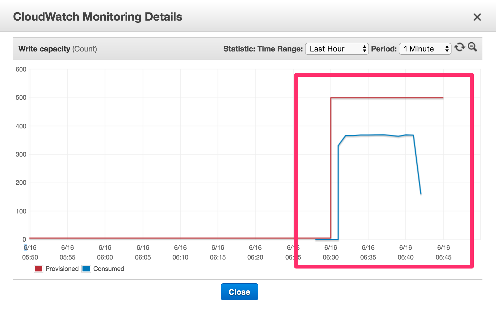
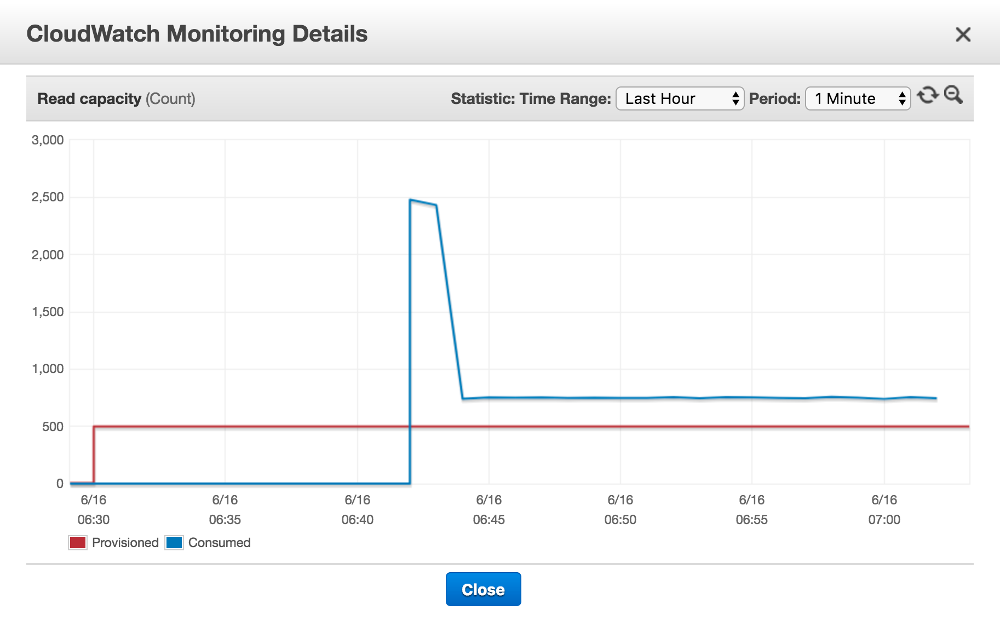

# Estudio sobre DynamoDB

DynamoDB es una base de datos NoSQL desarrollada por Amazon y que se ofrece como servicio dentro de Amazon Web Services (AWS), lo cual puede hacer que su funcionamiento sea un misterio en muchos casos. Con este proyecto se pretende obtener un mayor conocimiento de la herramienta así como detectar en qué casos de usos es útil y en cuales podría ser mejor optar por otra solución.

## Ventajas

Las principales ventajas ofrecidas por DynamoDB se refieren a su capacidad de escalado y a la ausencia de tareas de administración.

Por un lado se trata de un sistema __con un comportamiento constante y predecible__, ya que es capaz de realizar el particionado automáticamente. Y además es __un sistema muy escalable__ que se puede ajustar a todas las necesidades y cuya provisión de carga se puede ir ajustando dinámicamente, ya sea de forma manual o con la configuración de __autoescalado__.

Por otro lado __no requiere ninguna tarea de administración__, estas tareas son realizadas por Amazon que se encarga entre otras cosas de realizar los ajustes de optimización, replicación en diferentes zonas de disponibilidad o sustitución de hardware defectuoso entre otros.

## Desventajas

Como cualquier otro sistema posee una serie de desventajas, que en algunas situaciones podría hacer que no sea la solución más adecuada para el problema a resolver.

No se trata de una base de datos relacional,  por lo tanto:

* __No es un sistema ACID__, si por ejemplo se necesitasen transacciones no se podría delegar en DynamoDB.
* __No se pueden hacer joins entre tablas__, también este tipo de operaciones se deben realizar de forma externa a DynamoDB.

La comunicación con DynamoDB se realiza mediante HTTP, dependiendo de las necesidades esto también puede ser un problema, debido a que __aumenta ligeramente la latencia__ respecto a otras opciones como Amazon RDS o MongoDB Atlas.

Se debe pensar a priori en la estructura y provisión de la tabla a crear, porque __la creación y eliminación de tablas no es instantánea__ y __el provisionamiento de "workers" tarda un tiempo en hacerse efectivo__.

### Límites específicos

* Sólo se pueden crear 256 tablas por cuenta por zona de disponibilidad.
* Exite un límite de 1MB como respuesta de una query o un scan, _pero se puede usar LastEvaluatedItem para seguir obteniendo resultados_.
* Las operaciones en batch tienen varias limitaciones.
  * Un tamaño máximo de 16MB.
  * 100 items por batch de lectura.
  * 25 items por batch de escritura.

## Tests sintéticos

Para tener una idea aproximada del comportamiento (en escritura y lectura) que tendrá DynamoDB en "producción", se ha realizado una aplicación que lanza un batch de operaciones sobre una instancia de DynamoDB y se han obtenido una serie de medidas aproximadas.


__Hay que tener en cuenta que estás medidas incluyen la latencia de la red y no sólo el tiempo de procesamiento de DynamoDB__.

### Disclaimer

Estos tests se han realizado para tener una idea aproximada del comportamiento de DynamoDB, así como comprobar los posibles inconvenientes de su uso. __En ningún caso se debe tomar como un Benchmark válido__.

### 20 write units

Inserción de 10.000 items en un sistema configurado con 20 unidades de escritura.

```
-- Timers ----------------------------------------------------------------------
inserts
             count = 10000
         mean rate = 20.28 calls/second
     1-minute rate = 19.96 calls/second
     5-minute rate = 25.59 calls/second
    15-minute rate = 36.45 calls/second
               min = 42.18 milliseconds
               max = 7040.69 milliseconds
              mean = 269.76 milliseconds
            stddev = 716.13 milliseconds
            median = 43.51 milliseconds
              75% <= 347.59 milliseconds
              95% <= 1168.92 milliseconds
              98% <= 2578.78 milliseconds
              99% <= 4847.70 milliseconds
            99.9% <= 7032.88 milliseconds
```

### 200 write units (109.92$/month)

Inserción de 10.000 items en un sistema configurado con 200 unidades de escritura.

```
-- Timers ----------------------------------------------------------------------
inserts
             count = 10000
         mean rate = 175.59 calls/second
     1-minute rate = 175.89 calls/second
     5-minute rate = 184.17 calls/second
    15-minute rate = 185.29 calls/second
               min = 42.10 milliseconds
               max = 575.22 milliseconds
              mean = 46.65 milliseconds
            stddev = 32.44 milliseconds
            median = 43.34 milliseconds
              75% <= 44.01 milliseconds
              95% <= 49.52 milliseconds
              98% <= 54.77 milliseconds
              99% <= 62.82 milliseconds
            99.9% <= 575.22 milliseconds
```

### 500 write units (273.97$/month)

Inserción de 100.000 items en un sistema configurado con 500 unidades de escritura.

```
-- Timers ----------------------------------------------------------------------
inserts
             count = 100000
         mean rate = 164.47 calls/second
     1-minute rate = 132.92 calls/second
     5-minute rate = 154.46 calls/second
    15-minute rate = 169.63 calls/second
               min = 42.70 milliseconds
               max = 276.61 milliseconds
              mean = 45.05 milliseconds
            stddev = 8.71 milliseconds
            median = 43.74 milliseconds
              75% <= 44.59 milliseconds
              95% <= 50.24 milliseconds
              98% <= 54.88 milliseconds
              99% <= 61.37 milliseconds
            99.9% <= 272.71 milliseconds
```

Si repetimos la prueba con 50 threads en la máquina que lanza las operaciones.

```
-- Timers ----------------------------------------------------------------------
inserts
             count = 100000
         mean rate = 343.30 calls/second
     1-minute rate = 338.41 calls/second
     5-minute rate = 317.96 calls/second
    15-minute rate = 293.78 calls/second
               min = 42.06 milliseconds
               max = 328.21 milliseconds
              mean = 47.03 milliseconds
            stddev = 25.56 milliseconds
            median = 43.16 milliseconds
              75% <= 44.51 milliseconds
              95% <= 51.18 milliseconds
              98% <= 60.04 milliseconds
              99% <= 278.31 milliseconds
            99.9% <= 327.33 milliseconds
```

Nuevamente aumentando el número de threads hasta 500. No se mejora nada, probablemente la máquina de pruebas está saturada, ya que DynamoDB con 500 workers debería obtener velocidades mayores.

```
-- Timers ----------------------------------------------------------------------
inserts
             count = 100000
         mean rate = 340.97 calls/second
     1-minute rate = 336.01 calls/second
     5-minute rate = 317.63 calls/second
    15-minute rate = 295.29 calls/second
               min = 42.01 milliseconds
               max = 299.15 milliseconds
              mean = 46.39 milliseconds
            stddev = 18.89 milliseconds
            median = 43.49 milliseconds
              75% <= 45.20 milliseconds
              95% <= 53.09 milliseconds
              98% <= 60.11 milliseconds
              99% <= 74.61 milliseconds
            99.9% <= 298.97 milliseconds
```

### 10-1000 write units autoscaling @ 70% utilization

Inserción de 100.000 items en un sistema configurado con un autoescalado de 10 a 1000 unidades de escritura, partiendo de 200 unidades provisionadas.

```
-- Timers ----------------------------------------------------------------------
inserts
             count = 100000
         mean rate = 106.25 calls/second
     1-minute rate = 118.88 calls/second
     5-minute rate = 127.26 calls/second
    15-minute rate = 144.25 calls/second
               min = 42.12 milliseconds
               max = 1060.09 milliseconds
              mean = 48.96 milliseconds
            stddev = 48.31 milliseconds
            median = 44.32 milliseconds
              75% <= 46.70 milliseconds
              95% <= 52.44 milliseconds
              98% <= 55.65 milliseconds
              99% <= 63.26 milliseconds
            99.9% <= 1059.91 milliseconds
```

Durante la ejecución se puede observar un comportamiento algo extraño del autoesacalado, eliminando unidades de escritura del provisionado. __Esto se puede deber a que la ejecución del test sintético se ha realizado con una sola máquina__, y dicha máquina se puede haber saturado mientras esperaba respuesta, lo que afecta a como Dynamo hace el escalado.


### 5 read units getting by hash key over 100 queries with more than 250k items

```
-- Timers ----------------------------------------------------------------------
query
             count = 100
         mean rate = 42.97 calls/second
     1-minute rate = 0.00 calls/second
     5-minute rate = 0.00 calls/second
    15-minute rate = 0.00 calls/second
               min = 42.52 milliseconds
               max = 604.24 milliseconds
              mean = 78.05 milliseconds
            stddev = 108.00 milliseconds
            median = 54.85 milliseconds
              75% <= 67.40 milliseconds
              95% <= 84.32 milliseconds
              98% <= 603.60 milliseconds
              99% <= 604.23 milliseconds
            99.9% <= 604.24 milliseconds
```

### 5 read units scanning similar deviceId over 100 queries with more than 250k items

```
-- Timers ----------------------------------------------------------------------
scans
             count = 29
         mean rate = 0.48 calls/second
     1-minute rate = 2.22 calls/second
     5-minute rate = 4.25 calls/second
    15-minute rate = 4.73 calls/second
               min = 136.30 milliseconds
               max = 35381.27 milliseconds
              mean = 1549.69 milliseconds
            stddev = 6537.37 milliseconds
            median = 154.31 milliseconds
              75% <= 158.55 milliseconds
              95% <= 19436.11 milliseconds
              98% <= 35381.27 milliseconds
              99% <= 35381.27 milliseconds
            99.9% <= 35381.27 milliseconds
```

### Final test

Tras varios ajustes del sistema de prueba, la última prueba consiste en crear un data set común para las escrituras y las lecturas y realizar todas las pruebas de carga sobre una misma configuración de DynamoDB.

#### Instancia de DynamoDB

| | Value |
|-|-------|
| Write capacity | 500 |
| Read capacity | 500 |

#### Máquina de pruebas

| | Value |
|-|-------|
| Insert operations | 250.000 |
| Read operations | 30.000 |
| Threads | 100 |

#### Resultados

```
-- Timers ----------------------------------------------------------------------
inserts
             count = 250000
         mean rate = 74.66 calls/second
     1-minute rate = 0.00 calls/second
     5-minute rate = 0.05 calls/second
    15-minute rate = 17.73 calls/second
               min = 41.77 milliseconds
               max = 151.55 milliseconds
              mean = 43.44 milliseconds
            stddev = 4.53 milliseconds
            median = 42.80 milliseconds
              75% <= 43.18 milliseconds
              95% <= 45.64 milliseconds
              98% <= 50.22 milliseconds
              99% <= 60.38 milliseconds
            99.9% <= 149.50 milliseconds
queries
             count = 30000
         mean rate = 186.12 calls/second
     1-minute rate = 263.45 calls/second
     5-minute rate = 111.28 calls/second
    15-minute rate = 67.46 calls/second
               min = 40.11 milliseconds
               max = 5308.06 milliseconds
              mean = 54.59 milliseconds
            stddev = 193.08 milliseconds
            median = 41.25 milliseconds
              75% <= 41.95 milliseconds
              95% <= 46.81 milliseconds
              98% <= 54.96 milliseconds
              99% <= 271.62 milliseconds
            99.9% <= 5225.05 milliseconds
scans
             count = 21362
         mean rate = 8.02 calls/second
     1-minute rate = 2.35 calls/second
     5-minute rate = 5.87 calls/second
    15-minute rate = 9.28 calls/second
               min = 128.40 milliseconds
               max = 38094.44 milliseconds
              mean = 840.54 milliseconds
            stddev = 2112.71 milliseconds
            median = 300.73 milliseconds
              75% <= 676.55 milliseconds
              95% <= 2883.20 milliseconds
              98% <= 5935.41 milliseconds
              99% <= 10695.08 milliseconds
            99.9% <= 37757.83 milliseconds
```





```
java.util.concurrent.ExecutionException: com.amazonaws.services.dynamodbv2.model.ProvisionedThroughputExceededException: The level of configured provisioned throughput for the table was exceeded. Consider increasing your provisioning level with the UpdateTable API. (Service: AmazonDynamoDBv2; Status Code: 400; Error Code: ProvisionedThroughputExceededException; Request ID: P7JRFFNHG6TD55BSI9QE73CBQ3VV4KQNSO5AEMVJF66Q9ASUAAJG)
	at java.util.concurrent.ForkJoinTask.get(ForkJoinTask.java:1006)
	at com.yeray.test.dynamodb.tasks.DevicesScanner.launch(DevicesScanner.java:35)
	at com.yeray.test.dynamodb.Launcher.main(Launcher.java:45)
Caused by: com.amazonaws.services.dynamodbv2.model.ProvisionedThroughputExceededException: The level of configured provisioned throughput for the table was exceeded. Consider increasing your provisioning level with the UpdateTable API. (Service: AmazonDynamoDBv2; Status Code: 400; Error Code: ProvisionedThroughputExceededException; Request ID: P7JRFFNHG6TD55BSI9QE73CBQ3VV4KQNSO5AEMVJF66Q9ASUAAJG)
	at com.amazonaws.http.AmazonHttpClient$RequestExecutor.handleErrorResponse(AmazonHttpClient.java:1588)
	at com.amazonaws.http.AmazonHttpClient$RequestExecutor.executeOneRequest(AmazonHttpClient.java:1258)
	at com.amazonaws.http.AmazonHttpClient$RequestExecutor.executeHelper(AmazonHttpClient.java:1030)
	at com.amazonaws.http.AmazonHttpClient$RequestExecutor.doExecute(AmazonHttpClient.java:742)
	at com.amazonaws.http.AmazonHttpClient$RequestExecutor.executeWithTimer(AmazonHttpClient.java:716)
	at com.amazonaws.http.AmazonHttpClient$RequestExecutor.execute(AmazonHttpClient.java:699)
	at com.amazonaws.http.AmazonHttpClient$RequestExecutor.access$500(AmazonHttpClient.java:667)
	at com.amazonaws.http.AmazonHttpClient$RequestExecutionBuilderImpl.execute(AmazonHttpClient.java:649)
	at com.amazonaws.http.AmazonHttpClient.execute(AmazonHttpClient.java:513)
	at com.amazonaws.services.dynamodbv2.AmazonDynamoDBClient.doInvoke(AmazonDynamoDBClient.java:2089)
	at com.amazonaws.services.dynamodbv2.AmazonDynamoDBClient.invoke(AmazonDynamoDBClient.java:2065)
	at com.amazonaws.services.dynamodbv2.AmazonDynamoDBClient.executeScan(AmazonDynamoDBClient.java:1581)
	at com.amazonaws.services.dynamodbv2.AmazonDynamoDBClient.scan(AmazonDynamoDBClient.java:1557)
	at com.yeray.test.dynamodb.repository.DynamoRepository.getDevicesStartingWith(DynamoRepository.java:74)
	at com.yeray.test.dynamodb.tasks.DevicesScanner.scanRandomDevice(DevicesScanner.java:46)
	at com.yeray.test.dynamodb.tasks.DevicesScanner.lambda$null$0(DevicesScanner.java:33)
	at java.util.stream.ForEachOps$ForEachOp$OfInt.accept(ForEachOps.java:205)
	at java.util.stream.Streams$RangeIntSpliterator.forEachRemaining(Streams.java:110)
	at java.util.Spliterator$OfInt.forEachRemaining(Spliterator.java:693)
	at java.util.stream.AbstractPipeline.copyInto(AbstractPipeline.java:481)
	at java.util.stream.ForEachOps$ForEachTask.compute(ForEachOps.java:291)
	at java.util.concurrent.CountedCompleter.exec(CountedCompleter.java:731)
	at java.util.concurrent.ForkJoinTask.doExec(ForkJoinTask.java:289)
	at java.util.concurrent.ForkJoinPool$WorkQueue.runTask(ForkJoinPool.java:1056)
	at java.util.concurrent.ForkJoinPool.runWorker(ForkJoinPool.java:1692)
	at java.util.concurrent.ForkJoinWorkerThread.run(ForkJoinWorkerThread.java:157)
```

## Links

### Important information 

* [Throughput Capacity for Reads and Writes](http://docs.aws.amazon.com/amazondynamodb/latest/developerguide/HowItWorks.ProvisionedThroughput.html)

### Blogs

* [Amazon DynamoDB: ten things you really should know](https://cloudacademy.com/blog/amazon-dynamodb-ten-things/)
* [DynamoDB is awesom, but ...](http://simondlr.com/post/26360955465/dynamodb-is-awesome-but)
* [Scaling a startup using DynamoDB](https://syslog.ravelin.com/scaling-a-startup-using-dynamodb-4d97b0843350)
* [Using AWS DynamoDB - Pros and cons](https://bekitzur.com/blog/using-aws-dynamodb-pros-and-cons/)

### Vídeos

* [AWS re:Invent 2016: Toyota Racing Development Makes Racing Decisions in Real Time with AWS](https://www.youtube.com/watch?v=K6SHMFDMhYk)
* [AWS re:Invent 2016: Streaming ETL for RDS and DynamoDB](https://youtu.be/8KKNMy-EYxA)
* [AWS re:Invent 2016: You Can’t Protect What You Can’t See: Security & Compliance from Adobe](https://youtu.be/-C08o4vVH24)
