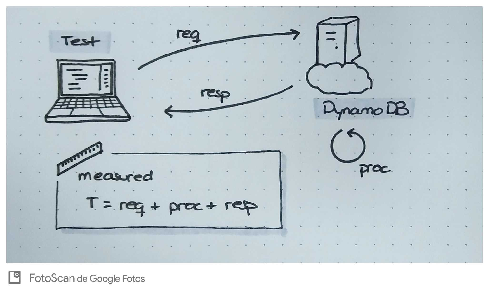
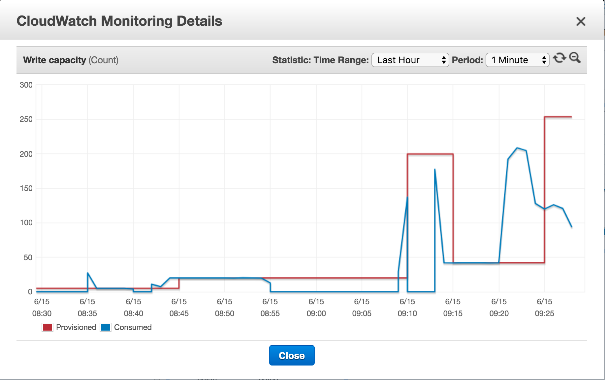

## DynamoDB tests

DynamoDB es una base de datos NoSQL desarrollada por Amazon y que se ofrece como servicio dentro de Amazon Web Services (AWS).

## Ventajas

* No requiere mantenimiento porque se delega integramente en Amazon AWS.
* Permite opciones de autoescalado.

## Limitaciones y contras

* No se trata de una base de datos relacional por lo que no existe la operación de __join__ entre tablas.
* Actualmente existe una limitación de 256 tablas por cuenta por zona de disponibilidad. __No se trata de un límite bajo en la mayoría de los casos pero es algo a tener muy en cuenta__.
* La creación y eliminación de tablas no es una operación instantánea y hay que tenerlo en cuenta cuando se hace programáticamente.
* Al no ser una base de datos relacional tenemos que tener en cuenta que no respeta las propiedades ACID.
* El provisionamiento de workers no es instantáneo, cosa que hay que tener en cuenta si no se dispone de un sistema configurado con autoescalado.
* Las queries tienen limitaciones y hay que tenerlas en cuenta a la hora de diseñar las tablas.
* Exite un límite de 1MB como respuesta de una query o un scan, _pero se puede usar LastEvaluatedItem para seguir obteniendo resultados_.
* Las operaciones en batch tienen varias limitaciones.
  * Un tamaño máximo de 16MB.
  * 100 items por batch de lectura.
  * 25 items por batch de escritura.

## Tests sintéticos

Para tener una idea aproximada del comportamiento (en escritura y lectura) que tendrá DynamoDB en "producción", se ha realizado una aplicación que lanza un batch de operaciones sobre una instancia de DynamoDB y se han obtenido una serie de medidas aproximadas.



__Hay que tener en cuenta que estás medidas incluyen la latencia de la red y no sólo el tiempo de procesamiento de DynamoDB__.

### Disclaimer

Estos tests se han realizado para tener una idea aproximada del comportamiento de DynamoDB, así como comprobar los posibles inconvenientes de su uso. __En ningún caso se debe tomar como un Benchmark válido__.

### 20 write units

Inserción de 10.000 items en un sistema configurado con 20 unidades de escritura.

```
-- Timers ----------------------------------------------------------------------
inserts
             count = 10000
         mean rate = 20.28 calls/second
     1-minute rate = 19.96 calls/second
     5-minute rate = 25.59 calls/second
    15-minute rate = 36.45 calls/second
               min = 42.18 milliseconds
               max = 7040.69 milliseconds
              mean = 269.76 milliseconds
            stddev = 716.13 milliseconds
            median = 43.51 milliseconds
              75% <= 347.59 milliseconds
              95% <= 1168.92 milliseconds
              98% <= 2578.78 milliseconds
              99% <= 4847.70 milliseconds
            99.9% <= 7032.88 milliseconds
```

### 200 write units (109.92$/month)

Inserción de 10.000 items en un sistema configurado con 200 unidades de escritura.

```
-- Timers ----------------------------------------------------------------------
inserts
             count = 10000
         mean rate = 175.59 calls/second
     1-minute rate = 175.89 calls/second
     5-minute rate = 184.17 calls/second
    15-minute rate = 185.29 calls/second
               min = 42.10 milliseconds
               max = 575.22 milliseconds
              mean = 46.65 milliseconds
            stddev = 32.44 milliseconds
            median = 43.34 milliseconds
              75% <= 44.01 milliseconds
              95% <= 49.52 milliseconds
              98% <= 54.77 milliseconds
              99% <= 62.82 milliseconds
            99.9% <= 575.22 milliseconds
```

### 500 write units (273.97$/month)

Inserción de 100.000 items en un sistema configurado con 500 unidades de escritura.

```
-- Timers ----------------------------------------------------------------------
inserts
             count = 100000
         mean rate = 164.47 calls/second
     1-minute rate = 132.92 calls/second
     5-minute rate = 154.46 calls/second
    15-minute rate = 169.63 calls/second
               min = 42.70 milliseconds
               max = 276.61 milliseconds
              mean = 45.05 milliseconds
            stddev = 8.71 milliseconds
            median = 43.74 milliseconds
              75% <= 44.59 milliseconds
              95% <= 50.24 milliseconds
              98% <= 54.88 milliseconds
              99% <= 61.37 milliseconds
            99.9% <= 272.71 milliseconds
```

Si repetimos la prueba con 50 threads en la máquina que lanza las operaciones.

```
-- Timers ----------------------------------------------------------------------
inserts
             count = 100000
         mean rate = 343.30 calls/second
     1-minute rate = 338.41 calls/second
     5-minute rate = 317.96 calls/second
    15-minute rate = 293.78 calls/second
               min = 42.06 milliseconds
               max = 328.21 milliseconds
              mean = 47.03 milliseconds
            stddev = 25.56 milliseconds
            median = 43.16 milliseconds
              75% <= 44.51 milliseconds
              95% <= 51.18 milliseconds
              98% <= 60.04 milliseconds
              99% <= 278.31 milliseconds
            99.9% <= 327.33 milliseconds
```

Nuevamente aumentando el número de threads hasta 500. No se mejora nada, probablemente la máquina de pruebas está saturada, ya que DynamoDB con 500 workers debería obtener velocidades mayores.

```
-- Timers ----------------------------------------------------------------------
inserts
             count = 100000
         mean rate = 340.97 calls/second
     1-minute rate = 336.01 calls/second
     5-minute rate = 317.63 calls/second
    15-minute rate = 295.29 calls/second
               min = 42.01 milliseconds
               max = 299.15 milliseconds
              mean = 46.39 milliseconds
            stddev = 18.89 milliseconds
            median = 43.49 milliseconds
              75% <= 45.20 milliseconds
              95% <= 53.09 milliseconds
              98% <= 60.11 milliseconds
              99% <= 74.61 milliseconds
            99.9% <= 298.97 milliseconds
```

### 10-1000 write units autoscaling @ 70% utilization

Inserción de 100.000 items en un sistema configurado con un autoescalado de 10 a 1000 unidades de escritura, partiendo de 200 unidades provisionadas.

```
-- Timers ----------------------------------------------------------------------
inserts
             count = 100000
         mean rate = 106.25 calls/second
     1-minute rate = 118.88 calls/second
     5-minute rate = 127.26 calls/second
    15-minute rate = 144.25 calls/second
               min = 42.12 milliseconds
               max = 1060.09 milliseconds
              mean = 48.96 milliseconds
            stddev = 48.31 milliseconds
            median = 44.32 milliseconds
              75% <= 46.70 milliseconds
              95% <= 52.44 milliseconds
              98% <= 55.65 milliseconds
              99% <= 63.26 milliseconds
            99.9% <= 1059.91 milliseconds
```

Durante la ejecución se puede observar un comportamiento algo extraño del autoesacalado, eliminando unidades de escritura del provisionado. __Esto se puede deber a que la ejecución del test sintético se ha realizado con una sola máquina__, y dicha máquina se puede haber saturado mientras esperaba respuesta, lo que afecta a como Dynamo hace el escalado.


